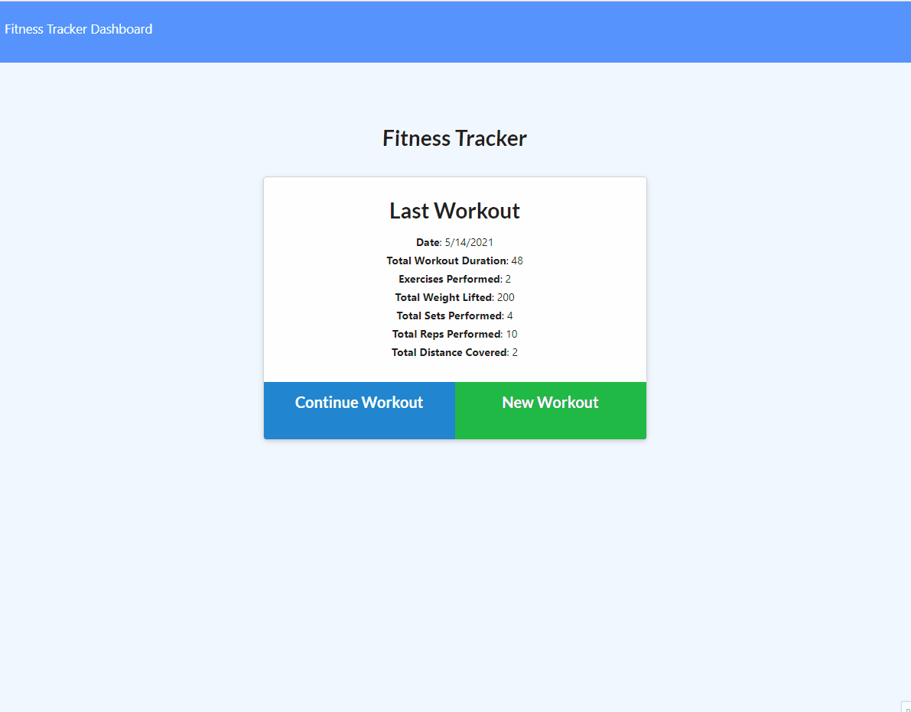
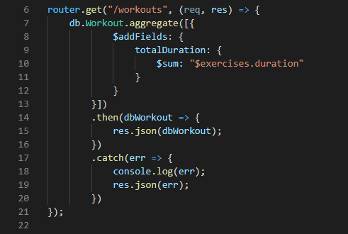
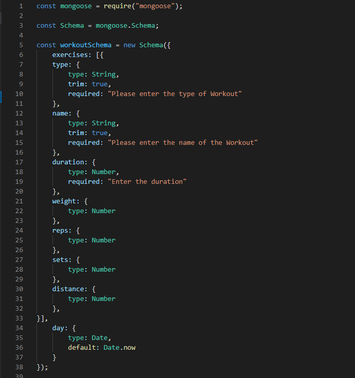

# Workout Tracker

  

## Description

In this assignment I was prompted with the task of making a workout tracker. A user will need to be able to add exercises to the most recent workout plan. Next a user will need to be able to add new exercises to a workout plan. Finally the user will need to be able to view the combined weight of multiple exercises from the past seven days as well as the total time duration. All tasks described above are complete. Please take a look into how it was made and the technologies used.

Please have a look at the full application deployed at the link below:

[Full-Site](https://rocky-brushlands-51729.herokuapp.com/)

## Table of Contents

* [Technology-Used](#technology-used)

* [Contribute](#contribute)

* [Tests](#tests)

* [Making](#making)

* [Questions](#questions)

## Technology-Used

- GitHub - repository storage for the project in order to amke changes, deploy them and push to a main branch. 

- GitBash - used for written commands and communicating with the repository stored on GitHub.

- Javascript - a programming language that makes your webpage user interactive.

- Node.js - an efficient platform that runs Javascript outside of the web browser.

- MongoDB - classified as NoSQL which is a document oriented database program.

- Mongoose - an Object Data Modeling library for MongoDB.

- Robo3T - a desktop graphical user interface to use with MongoDB.

- Express - framework for Node.js that has multiple built in methods to condense code.

## Contribute 
    
In order to contribute, you will need to know the following languges:
    
  - Node, Javascript, MondoDB, Mongoose, Express.

## Tests

To run tests, please use the following command:

  - npm start

## Making

Before the making, here's an example of how the application works:

How was it made? Take a look here!

This is an example of the aggregate method which will allow me to add all of the fields specified into one key value being created.

This is an example of the model of a Workout. 

## Questions

Please click the link to see my Full GitHub profile:

[GitHub](https://github.com/dnovelli1)

If you have any questions, please see the following links to best get in contact with me:

[Email Me](jakenovelli11@gmail.com)

## License

This project is currently licensed under the MIT [License](https://choosealicense.com/licenses/mit/)
  
